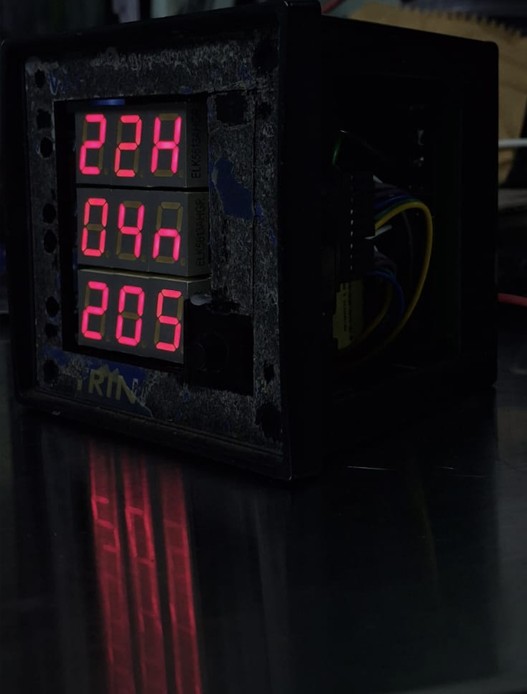
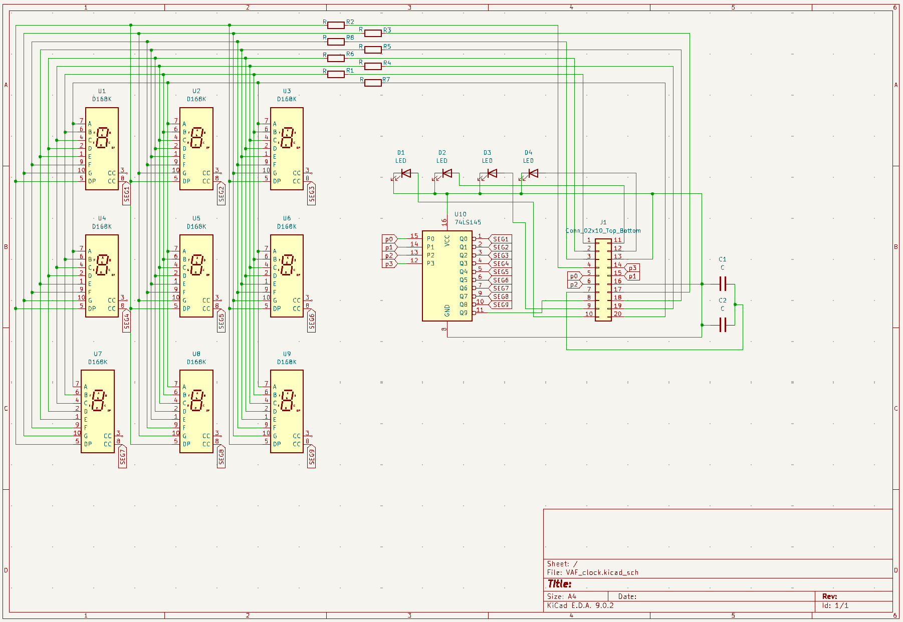
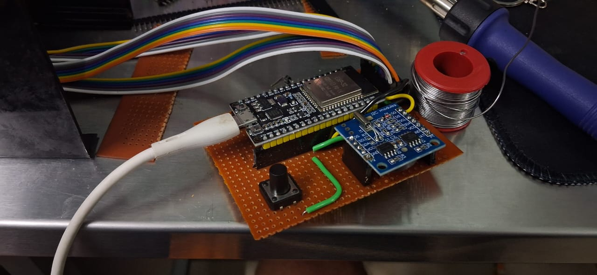
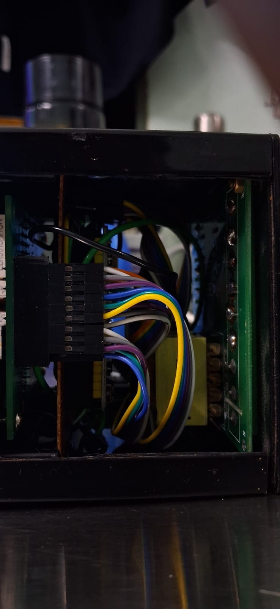

# VAF-Clock

A unique digital clock project built by reverse-engineering a commercial VAF (Voltage, Amperage, Frequency) meter. This project repurposes the meter's enclosure and 7-segment display, driving them with an ESP32 and an RTC module for precise timekeeping.

## Overview

This project was born from curiosity. Starting with a standard VAF meter, I used a multimeter to reverse-engineer the PCB traces and understand the display driver logic. The original mainboard was replaced (or bypassed) with a custom solution powered by an ESP32.

The result is a retro-industrial style clock that retains the rugged look of the original panel meter while running modern firmware.

## How It Works

The VAF meter's display is a classic example of **multiplexing** to control a large number of LEDs with limited pins.

- **Segment Control**: All segment signal pins (A-G, DP) are connected in parallel across the digits.
- **Digit Selection**: A **74LS145** (BCD-to-Decimal Decoder/Driver) is used to activate one digit (or group of segments) at a time.
- **Persistence of Vision**: The ESP32 switches between digits rapidly. This happens so fast that the human eye perceives all utilized segments as being lit simultaneously.

By tracing the connections with a multimeter in continuity mode, I mapped the pinout of the display board to the ESP32, allowing full control over the digits.

## Hardware

- **Controller**: ESP32 Development Board
- **Timekeeping**: RTC Module (DS3231 or similar)
- **Driver**: 74LS145 (BCD-to-Decimal Decoder)
- **Enclosure/Display**: Repurposed VAF Meter Case & 7-Segment Display

## Schematic & Wiring

The schematic below illustrates how the ESP32 interfaces with the 74LS145 and the display segments.

**General Pin Mapping Strategy:**
1. **Segments**: Connected directly to ESP32 GPIOs (via current limiting resistors).
2. **Digit Select**: 4 GPIOs from ESP32 connected to the ABCD inputs of the 74LS145.

*(Check the code for the exact GPIO pin definitions used in this build.)*

## 📸 Gallery

| Internal Wiring | Side View |
| :---: | :---: |
|  |  |

## Getting Started

### Prerequisites
- [Arduino IDE](https://www.arduino.cc/en/software)
- ESP32 Board Manager installed in Arduino IDE.
- RTC Library (e.g., `RTClib` by Adafruit) installed via Library Manager.

### Installation
1. Clone or download this repository.
2. Open the `.ino` file in Arduino IDE.
3. Select your ESP32 board model under **Tools > Board**.
4. Verify the pin definitions in the code match your specific wiring.
5. Upload the code to your ESP32.

## Contributing

Feel free to fork this repository and submit pull requests. If you have a different model of VAF meter, pinouts may vary—contributions documenting other models are welcome!

## License

This project is open-source. Please check the [LICENSE](LICENSE) file for details.